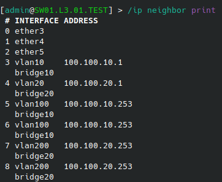

University: [ITMO University](https://itmo.ru/ru/)

Faculty: [FICT](https://fict.itmo.ru)

Course: [Introduction in routing](https://github.com/itmo-ict-faculty/introduction-in-routing)

Year: 2024/2025

Group: K3320

Author: Martynyuk Alexey

Date of create: 13.01.2025

Date of finished: 15.01.2025

# Лабораторная работа №1 "Установка ContainerLab и развертывание тестовой сети связи"

## Ход работы:

1. Для начала была настроена среда выполнения ContainerLab и установлен образ MikroTik.

2. Далее был написан файл lab1.clab.yaml, описывающий все устройства и соединения между ними через mgmt сеть. Его можно посмотреть в этой же папке(lab1.clab.yaml). С помощью команды sudo containerlab deploy были запущены сетевые устройства:


3. Далее с помощью ssh я подключался к устройствам и прописывал их конфигурацию для создания топологии, представленной в задании:

**Router(R01.TEST)**
```
/interface vlan
add interface=ether3 name=vlan10 vlan-id=10
add interface=ether3 name=vlan20 vlan-id=20
/interface wireless security-profiles
set [ find default=yes ] supplicant-identity=MikroTik
/ip pool
add name=pool10 ranges=100.100.10.5-100.100.10.254
add name=pool20 ranges=100.100.20.5-100.100.20.254
/ip dhcp-server
add address-pool=pool10 disabled=no interface=vlan10 name=dhcp10
add address-pool=pool20 disabled=no interface=vlan20 name=dhcp20
/ip address
add address=100.100.10.1/24 interface=vlan10 network=100.100.10.0
add address=100.100.20.1/24 interface=vlan20 network=100.100.20.0
/ip dhcp-client
add disabled=no interface=ether1
/ip dhcp-server network
add address=100.100.10.0/24 gateway=100.100.10.1
add address=100.100.20.0/24 gateway=100.100.20.1
/system identity
set name=R01.TEST
```

**Switch1(SW01.L3.01.TEST)**
```
/interface bridge
add name=bridge10
add name=bridge20
/interface vlan
add interface=ether3 name=vlan10 vlan-id=10
add interface=ether3 name=vlan20 vlan-id=20
add interface=ether4 name=vlan100 vlan-id=10
add interface=ether5 name=vlan200 vlan-id=20
/interface wireless security-profiles
set [ find default=yes ] supplicant-identity=MikroTik
/interface bridge port
add bridge=bridge10 interface=vlan10
add bridge=bridge20 interface=vlan20
add bridge=bridge10 interface=vlan100
add bridge=bridge20 interface=vlan200
/ip dhcp-client
add disabled=no interface=ether1
add disabled=no interface=bridge10
add disabled=no interface=bridge20
/system identity
set name=SW01.L3.01.TEST
```

**Switch2(SW02.L3.01.TEST)**
```
/interface bridge
add name=bridge10
/interface vlan
add interface=ether3 name=vlan10 vlan-id=10
/interface wireless security-profiles
set [ find default=yes ] supplicant-identity=MikroTik
/interface bridge port
add bridge=bridge10 interface=vlan10
add bridge=bridge10 interface=ether4
/ip dhcp-client
add disabled=no interface=ether1
add disabled=no interface=bridge10
/system identity
set name=SW02.L3.01.TEST
```

**Switch3(SW02.L3.02.TEST)**
```
/interface bridge
add name=bridge20
/interface vlan
add interface=ether3 name=vlan20 vlan-id=20
/interface wireless security-profiles
set [ find default=yes ] supplicant-identity=MikroTik
/interface bridge port
add bridge=bridge20 interface=vlan20
add bridge=bridge20 interface=ether4
/ip dhcp-client
add disabled=no interface=ether1
add disabled=no interface=bridge20
/system identity
set name=SW02.L3.02.TEST
```
4. Схема настроенной сети получилась следующая:
   


5. Для корректной работы dhcp-сервера нужно было подключиться к контейнирам с alpine и прописать им команду на получение ip от dhcp(udhcpc):


   
6. И теперь проверим локальную связность сети. Для этого пропингуем устройства между собой:

**R01 --> PC1/PC2**


**SW02.01**


**SW01.01**



## Вывод:
В результате выполнения лабораторной работы были получены навыки работы с ContainerLab, были изучены и настроены VLAN и DHCP-сервер.


