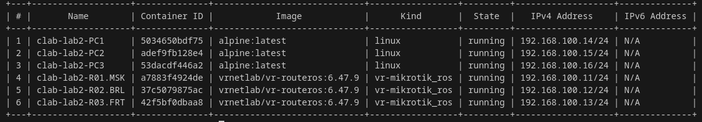
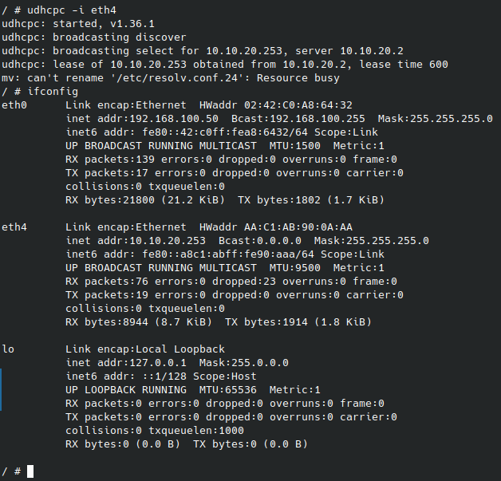
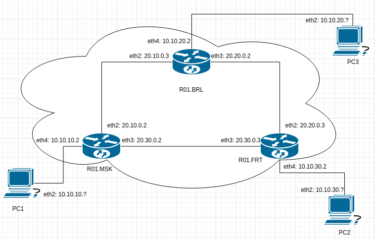
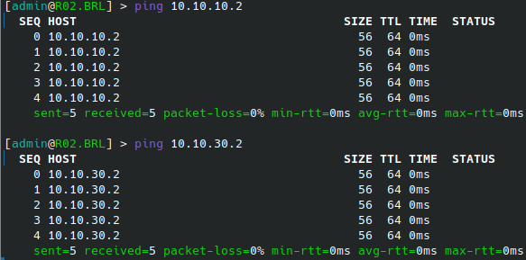
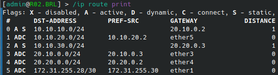
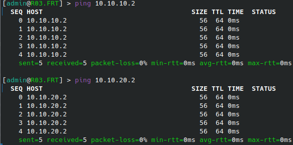
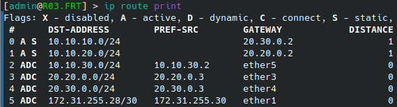

University: [ITMO University](https://itmo.ru/ru/)'

Faculty: [FICT](https://fict.itmo.ru)

Course: [Introduction in routing](https://github.com/itmo-ict-faculty/introduction-in-routing)

Year: 2024/2025

Group: K3320

Author: Martynyuk Alexey

Lab: Lab2

Date of create: 15.01.2025

Date of finished: 17.01.2025

# Лабораторная работа №2 "Эмуляция распределенной корпоративной сети связи, настройка статической маршрутизации между филиалами"

## Ход работы:

1. Был написан файл lab2.clab.yaml, описывающий все устройства и соединения между ними через mgmt сеть. Его можно посмотреть в этой же папке(lab2.clab.yaml). С помощью команды sudo containerlab deploy были запущены сетевые устройства:




2. Далее с помощью ssh я подключался к устройствам и прописывал их конфигурацию для создания топологии, представленной в задании:

**R01.MSK**

```
/interface ethernet
set [ find default-name=ether1 ] disable-running-check=no
set [ find default-name=ether2 ] disable-running-check=no
set [ find default-name=ether3 ] disable-running-check=no
set [ find default-name=ether4 ] disable-running-check=no
set [ find default-name=ether5 ] disable-running-check=no
/interface wireless security-profiles
set [ find default=yes ] supplicant-identity=MikroTik
/ip pool
add name=msk ranges=10.10.10.10-10.10.10.253
/ip dhcp-server
add address-pool=msk disabled=no interface=ether5 name=dhcp_server_msk
/ip address
add address=172.31.255.30/30 interface=ether1 network=172.31.255.28
add address=20.10.0.2/24 interface=ether3 network=20.10.0.0
add address=20.30.0.2/24 interface=ether4 network=20.30.0.0
add address=10.10.10.2/24 interface=ether5 network=10.10.10.0
/ip dhcp-client
add disabled=no interface=ether1
/ip dhcp-server network
add address=10.10.10.0/24 dns-server=8.8.8.8 gateway=10.10.10.2
/ip route
add distance=1 dst-address=10.10.20.0/24 gateway=20.10.0.3
add distance=1 dst-address=10.10.30.0/24 gateway=20.30.0.3
/system identity
set name=R01.MSK
```

**R02.BRL**

```
/interface ethernet
set [ find default-name=ether1 ] disable-running-check=no
set [ find default-name=ether2 ] disable-running-check=no
set [ find default-name=ether3 ] disable-running-check=no
set [ find default-name=ether4 ] disable-running-check=no
set [ find default-name=ether5 ] disable-running-check=no
/interface wireless security-profiles
set [ find default=yes ] supplicant-identity=MikroTik
/ip pool
add name=brl ranges=10.10.20.50-10.10.20.253
/ip dhcp-server
add address-pool=brl disabled=no interface=ether5 name=dhcp_server_brl
/ip address
add address=172.31.255.30/30 interface=ether1 network=172.31.255.28
add address=20.10.0.3/24 interface=ether3 network=20.10.0.0
add address=20.20.0.2/24 interface=ether4 network=20.20.0.0
add address=10.10.20.2/24 interface=ether5 network=10.10.20.0
/ip dhcp-client
add disabled=no interface=ether1
/ip dhcp-server network
add address=10.10.20.0/24 dns-server=8.8.8.8 gateway=10.10.20.2
/ip route
add distance=1 dst-address=10.10.10.0/24 gateway=20.10.0.2
add distance=1 dst-address=10.10.30.0/24 gateway=20.20.0.3
/system identity
set name=R02.BRL
```

**R03.FRT**

```
/interface ethernet
set [ find default-name=ether1 ] disable-running-check=no
set [ find default-name=ether2 ] disable-running-check=no
set [ find default-name=ether3 ] disable-running-check=no
set [ find default-name=ether4 ] disable-running-check=no
set [ find default-name=ether5 ] disable-running-check=no
/interface wireless security-profiles
set [ find default=yes ] supplicant-identity=MikroTik
/ip pool
add name=frt ranges=10.10.30.50-10.10.30.253
/ip dhcp-server
add address-pool=frt disabled=no interface=ether5 name=dhcp_server_frt
/ip address
add address=172.31.255.30/30 interface=ether1 network=172.31.255.28
add address=20.20.0.3/24 interface=ether3 network=20.20.0.0
add address=20.30.0.3/24 interface=ether4 network=20.30.0.0
add address=10.10.30.2/24 interface=ether5 network=10.10.30.0
/ip dhcp-client
add disabled=no interface=ether1
/ip dhcp-server network
add address=10.10.30.0/24 dns-server=8.8.8.8 gateway=10.10.30.2
/ip route
add distance=1 dst-address=10.10.10.0/24 gateway=20.30.0.2
add distance=1 dst-address=10.10.20.0/24 gateway=20.20.0.2
/system identity
set name=R03.FRT
```

3. Аналогично первой работе настроим PC1, PC2, PC3 на получение ip-адреса от dhcp-сервера.



4. Схема настроенной сети получилась следующая:
   

   
5. Проверим локальную связность сети с помощью команды ip route print и ping для всех устройств в сети:

**R02.BRL**






**R01.MSK**


**R03.FRT**






## Вывод:

В результате выполнения лабораторной работы была изучены и настроены статическая маршрутизация меджу роутерами и DHCP-сервер.