University: [ITMO University](https://itmo.ru/ru/)'

Faculty: [FICT](https://fict.itmo.ru)

Course: [Introduction in routing](https://github.com/itmo-ict-faculty/introduction-in-routing)

Year: 2024/2025

Group: K3320

Author: Martynyuk Alexey

Lab: Lab3

Date of create: 17.01.2025

Date of finished: 20.01.2025

# Лабораторная работа №3 "Эмуляция распределенной корпоративной сети связи, настройка OSPF и MPLS, организация первого EoMPLS"

## Ход работы:

1. Был написан файл lab3.clab.yaml, описывающий все устройства и соединения между ними через mgmt сеть. Его можно посмотреть в этой же папке(lab3.clab.yaml). С помощью команды sudo containerlab deploy были запущены сетевые устройства:

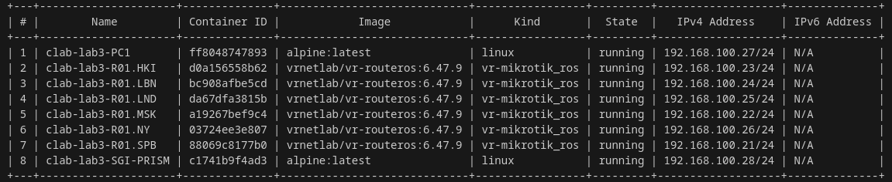


2. Далее с помощью ssh я подключался к устройствам и прописывал их конфигурацию для создания топологии, представленной в задании:

* PE-роутеры(NY, SPB):

**R01.SPB**

```
/interface bridge
add name=loopbackbridge
add name=vpn
/interface ethernet
set [ find default-name=ether1 ] disable-running-check=no
set [ find default-name=ether2 ] disable-running-check=no
set [ find default-name=ether3 ] disable-running-check=no
set [ find default-name=ether4 ] disable-running-check=no
set [ find default-name=ether5 ] disable-running-check=no
/interface vpls
add disabled=no l2mtu=1500 mac-address=02:BD:27:52:DB:8E name=EoMPLS remote-peer=10.10.10.7 vpls-id=100:100
/interface wireless security-profiles
set [ find default=yes ] supplicant-identity=MikroTik
/routing ospf instance
set [ find default=yes ] router-id=10.10.10.2
/interface bridge port
add bridge=vpn interface=ether5
add bridge=vpn interface=EoMPLS
/ip address
add address=172.31.255.30/30 interface=ether1 network=172.31.255.28
add address=10.10.10.2 interface=loopbackbridge network=10.10.10.2
add address=100.100.106.102/30 interface=ether3 network=100.100.106.100
add address=100.100.107.101/30 interface=ether4 network=100.100.107.100
/ip dhcp-client
add disabled=no interface=ether1
/mpls ldp
set enabled=yes lsr-id=10.10.10.2 transport-address=10.10.10.2
/mpls ldp interface
add interface=ether3
add interface=ether4
add interface=ether5
/routing ospf network
add area=backbone network=10.10.10.2/32
add area=backbone network=100.100.106.100/30
add area=backbone network=100.100.107.100/30
add area=backbone network=100.100.108.100/30
/system identity
set name=R01.SPB
```

**R01.NY**

```
/interface bridge
add name=loopbackbridge
add name=vpn
/interface ethernet
set [ find default-name=ether1 ] disable-running-check=no
set [ find default-name=ether2 ] disable-running-check=no
set [ find default-name=ether3 ] disable-running-check=no
set [ find default-name=ether4 ] disable-running-check=no
set [ find default-name=ether5 ] disable-running-check=no
/interface vpls
add disabled=no l2mtu=1500 mac-address=02:BD:27:52:DB:8E name=EoMPLS remote-peer=10.10.10.2 vpls-id=100:100
/interface wireless security-profiles
set [ find default=yes ] supplicant-identity=MikroTik
/routing ospf instance
set [ find default=yes ] router-id=10.10.10.7
/interface bridge port
add bridge=vpn interface=ether5
add bridge=vpn interface=EoMPLS
/ip address
add address=172.31.255.30/30 interface=ether1 network=172.31.255.28
add address=10.10.10.7 interface=loopbackbridge network=10.10.10.7
add address=100.100.102.101/30 interface=ether4 network=100.100.102.100
add address=100.100.101.101/30 interface=ether3 network=100.100.101.100
/ip dhcp-client
add disabled=no interface=ether1
/mpls ldp
set enabled=yes lsr-id=10.10.10.7 transport-address=10.10.10.7
/mpls ldp interface
add interface=ether3
add interface=ether4
add interface=ether5
/routing ospf network
add area=backbone network=10.10.10.7/32
add area=backbone network=100.100.101.100/30
add area=backbone network=100.100.102.100/30
/system identity
set name=R01.NY
```

* P-роутеры(MSK, HKI, LBN, LND):

**R01.MSK**

```
/interface bridge
add name=loopbackbridge
/interface ethernet
set [ find default-name=ether1 ] disable-running-check=no
set [ find default-name=ether2 ] disable-running-check=no
set [ find default-name=ether3 ] disable-running-check=no
set [ find default-name=ether4 ] disable-running-check=no
/interface wireless security-profiles
set [ find default=yes ] supplicant-identity=MikroTik
/routing ospf instance
set [ find default=yes ] router-id=10.10.10.3
/ip address
add address=172.31.255.30/30 interface=ether1 network=172.31.255.28
add address=10.10.10.3 interface=loopbackbridge network=10.10.10.3
add address=100.100.107.102/30 interface=ether4 network=100.100.107.100
add address=100.100.105.102/30 interface=ether3 network=100.100.105.100
/ip dhcp-client
add disabled=no interface=ether1
/mpls ldp
set enabled=yes lsr-id=10.10.10.3 transport-address=10.10.10.3
/mpls ldp interface
add interface=ether3
add interface=ether4
/routing ospf network
add area=backbone network=10.10.10.3/32
add area=backbone network=100.100.107.100/30
add area=backbone network=100.100.105.100/30
/system identity
set name=R01.MSK
```

**R01.HKI**

```
/interface bridge
add name=loopbackbridge
/interface ethernet
set [ find default-name=ether1 ] disable-running-check=no
set [ find default-name=ether2 ] disable-running-check=no
set [ find default-name=ether3 ] disable-running-check=no
set [ find default-name=ether4 ] disable-running-check=no
set [ find default-name=ether5 ] disable-running-check=no
/interface wireless security-profiles
set [ find default=yes ] supplicant-identity=MikroTik
/routing ospf instance
set [ find default=yes ] router-id=10.10.10.5
/ip address
add address=172.31.255.30/30 interface=ether1 network=172.31.255.28
add address=10.10.10.5 interface=loopbackbridge network=10.10.10.5
add address=100.100.103.102/30 interface=ether3 network=100.100.103.100
add address=100.100.104.101/30 interface=ether4 network=100.100.104.100
add address=100.100.106.101/30 interface=ether5 network=100.100.106.100
/ip dhcp-client
add disabled=no interface=ether1
/mpls ldp
set enabled=yes lsr-id=10.10.10.5 transport-address=10.10.10.5
/mpls ldp interface
add interface=ether3
add interface=ether4
add interface=ether5
/routing ospf network
add area=backbone network=10.10.10.5/32
add area=backbone network=100.100.103.100/30
add area=backbone network=100.100.106.100/30
add area=backbone network=100.100.104.100/30
/system identity
set name=R01.HKI
```

**R01.LND**

```
/interface bridge
add name=loopbackbridge
/interface ethernet
set [ find default-name=ether1 ] disable-running-check=no
set [ find default-name=ether2 ] disable-running-check=no
set [ find default-name=ether3 ] disable-running-check=no
set [ find default-name=ether4 ] disable-running-check=no
/interface wireless security-profiles
set [ find default=yes ] supplicant-identity=MikroTik
/routing ospf instance
set [ find default=yes ] router-id=10.10.10.6
/ip address
add address=172.31.255.30/30 interface=ether1 network=172.31.255.28
add address=10.10.10.6 interface=loopbackbridge network=10.10.10.6
add address=100.100.102.102/30 interface=ether3 network=100.100.102.100
add address=100.100.103.101/30 interface=ether4 network=100.100.103.100
/ip dhcp-client
add disabled=no interface=ether1
/mpls ldp
set enabled=yes lsr-id=10.10.10.6 transport-address=10.10.10.6
/mpls ldp interface
add interface=ether3
add interface=ether4
/routing ospf network
add area=backbone network=10.10.10.6/32
add area=backbone network=100.100.102.100/30
add area=backbone network=100.100.103.100/30
/system identity
set name=R01.LND
```

**R01.LBN**

```
/interface bridge
add name=loopbackbridge
/interface ethernet
set [ find default-name=ether1 ] disable-running-check=no
set [ find default-name=ether2 ] disable-running-check=no
set [ find default-name=ether3 ] disable-running-check=no
set [ find default-name=ether4 ] disable-running-check=no
set [ find default-name=ether5 ] disable-running-check=no
/interface wireless security-profiles
set [ find default=yes ] supplicant-identity=MikroTik
/routing ospf instance
set [ find default=yes ] router-id=10.10.10.4
/ip address
add address=172.31.255.30/30 interface=ether1 network=172.31.255.28
add address=10.10.10.4 interface=loopbackbridge network=10.10.10.4
add address=100.100.101.102/30 interface=ether3 network=100.100.101.100
add address=100.100.104.102/30 interface=ether4 network=100.100.104.100
add address=100.100.105.101/30 interface=ether5 network=100.100.105.100
/ip dhcp-client
add disabled=no interface=ether1
/mpls ldp
set enabled=yes lsr-id=10.10.10.4 transport-address=10.10.10.4
/mpls ldp interface
add interface=ether3
add interface=ether4
add interface=ether5
/routing ospf network
add area=backbone network=10.10.10.4/32
add area=backbone network=100.100.105.100/30
add area=backbone network=100.100.101.100/30
add area=backbone network=100.100.104.100/30
/system identity
set name=R01.LBN
```

3. Получились следующие маршруты на каждом роутере:

**R01.SPB**

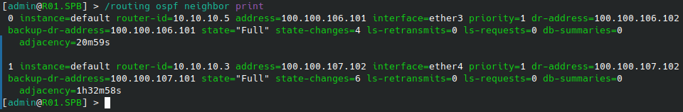

**R01.NY**

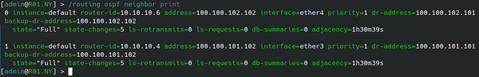

**R01.MSK**

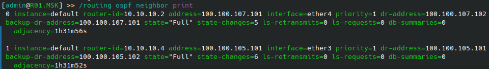

**R01.LBN**

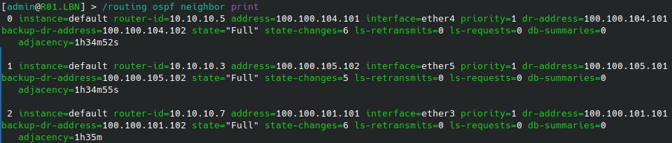

**R01.LND**

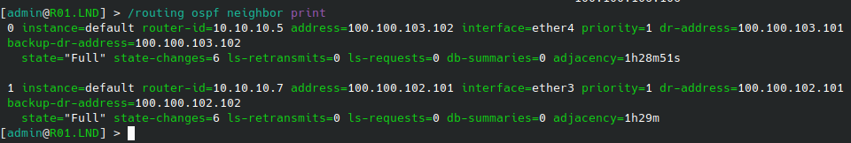

**R01.HKI**

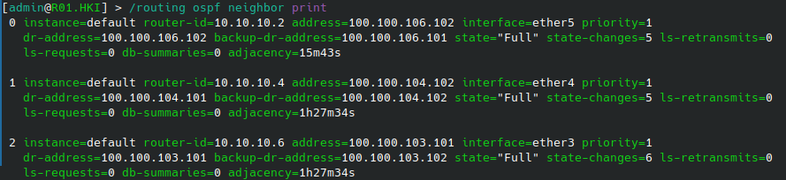

4. Также необходимо было повесить на интерфейсы клиентских машин ip-адреса из одной сети:

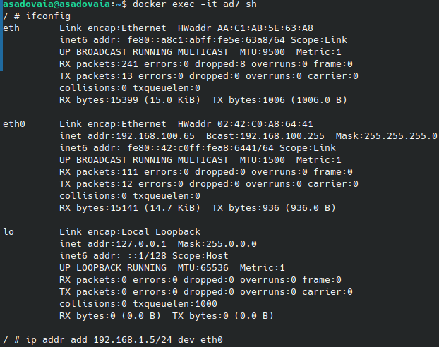

5. После всех необходимых настроек получили следующую схему сети:
   
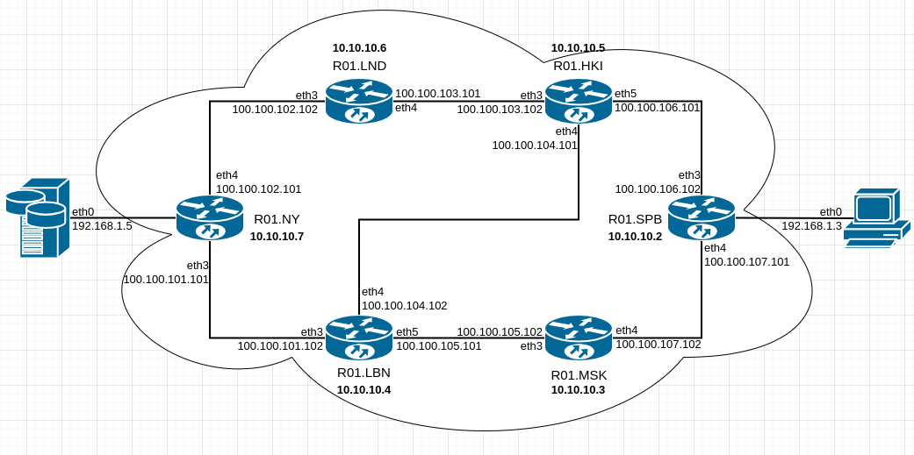
   
6. Для проверки работоспособности сети пропингуем с PC1 наш сервер SGI-PRISM и в обратную сторону:

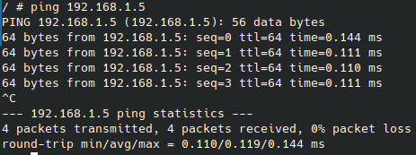

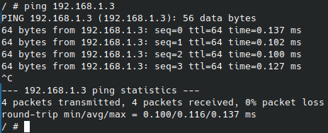

7. Посмотрим трассировку с R01.SPB в R01.NY через различные пути:

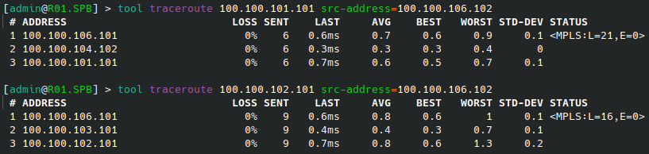

## Вывод:

В результате выполнения лабораторной работы были освоены методы работы с протоколами OSPF и MPLS, изучен и настроен механизм организации EoMPLS.